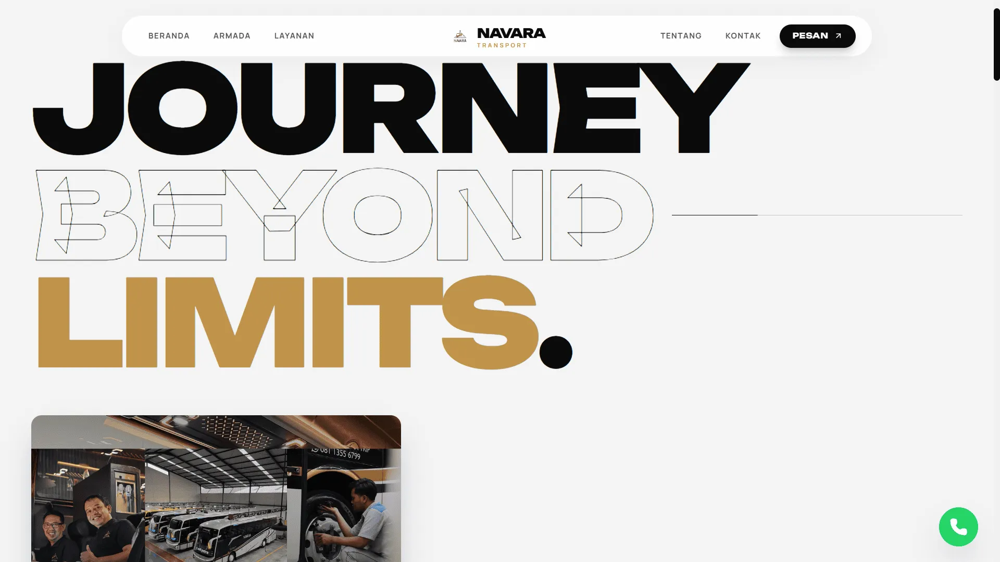
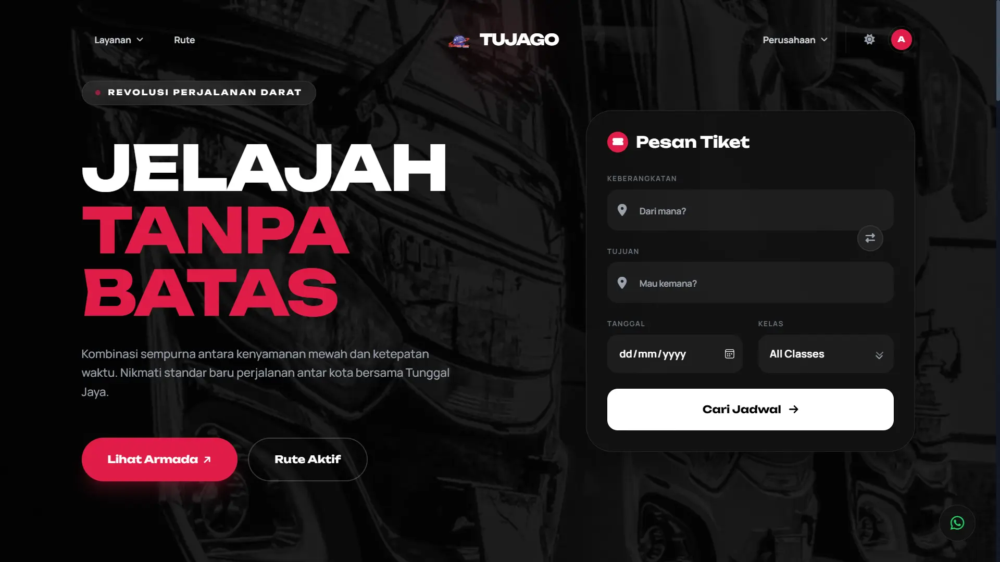
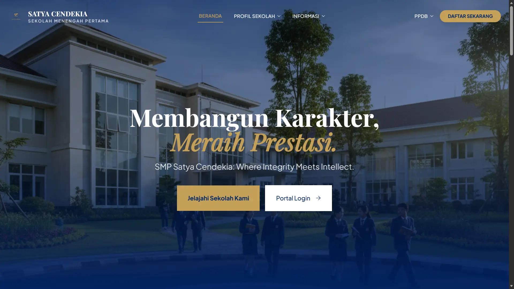

  
  <h1 align="center">Hi there, I'm Darell Rangga! </h1>

  

    
  

  

    
    
    
  

---

### 🚀 About Me

I am a results-driven **Fullstack Engineer** responsible for architecting scalable web solutions. My expertise lies in the **React ecosystem** (Next.js) and **Laravel** (TALL/VILT stack), where I blend systems engineering with creative design to build robust, high-performance applications. I am deeply passionate about **Immersive Web Experiences**, currently expanding my capabilities in **Three.js** and **WebGL** to push the boundaries of modern UI/UX. Beyond coding, I am an advocate for open-source collaboration within the JavaScript & PHP communities.

---

### 🛠️ Skills Inventory

#### 💻 The Bread & Butter (Core Stack)

  

#### 🚀 Specialized Frameworks & Libraries

  

  
  
  
  

#### 🛠️ Tools & DevOps

  
  
  

  

#### 🔠 Programming Languages

  

---

### 💎 Featured Work

|                       **Navara Trans**                        |                   **TUJAGO (Tunggal Jaya)**                   |                 **Satya Hub (Siakad)**                  |
| :-----------------------------------------------------------: | :-----------------------------------------------------------: | :-----------------------------------------------------: |
|        |        |  |
|                      **"Clean Luxury"**                       |                    **"Integrated System"**                    |                 **"Unified Ecosystem"**                 |
| WhatsApp Booking Engine   _Practical No-Backend Solution_ | Digital Transformation   _Fleet Management & PDF Tickets_ |    Zero Friction   _Real-time Schedule & Tasks_     |

---

### 📊 GitHub Stats

  
  
  

---

### 💻 Daily Wisdom

  

---

### 🎮 Let's Play!

  <picture>
    <source media="(prefers-color-scheme: light)" srcset="https://raw.githubusercontent.com/Rangga11268/Rangga11268/output/pacman-contribution-graph.svg">
    
  </picture>

  
  
  
     
  

