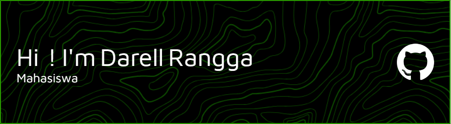

## Hi I'm Darell Rangga 👋

Saya seorang Web Developer yang bersemangat dalam membangun aplikasi web yang fungsional dan menarik. Saya memiliki pengalaman dengan tumpukan teknologi modern dan selalu antusias untuk mempelajari hal-hal baru.

- 🌱 Saya sedang mendalami **React.js dan TypeScript** untuk memperluas keahlian front-end saya.
- 👯 Saya terbuka untuk berkolaborasi dalam proyek open-source yang berkaitan dengan ekosistem PHP atau JavaScript.

- 📫 Anda bisa menghubungi saya melalui **[LinkedIn](https://www.linkedin.com/in/darell-rangga-1320b634b/)** atau **darrelrangga@gmail.com**.

#### My Skills

  
  
  
  
  
  
  
  
  
  
  

#### Connect With Me

  
  
  
  

#### Play Games With Me
<picture>
  <source media="(prefers-color-scheme: light)" srcset="https://raw.githubusercontent.com/Rangga11268/Rangga11268/output/pacman-contribution-graph.svg">
  
</picture>
